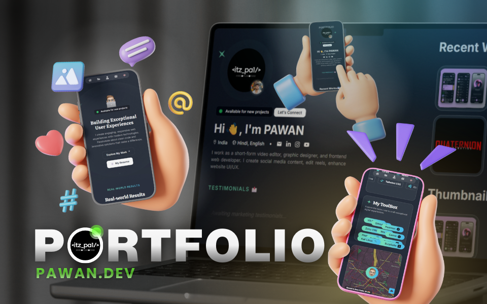

# 📃 PAWAN.DEV — Developer Portfolio

<p align="center">
  
  
  
  
</p>

<p align="center">
  <b>Personal portfolio showcasing projects, skills & experiments in modern web development.</b>
</p>

<p align="center">
  🌐 <a href="https://codeitzpa1.vercel.app/">Live Website</a> • 💻 Full-Stack Dev • ⚡ Performance-Focused
</p>



---

## ✨ Why pawan.dev?

**pawan.dev** is my personal corner on the web — a clean, fast, and minimal portfolio built to showcase:

- Real-world projects
- Technical skills & tools
- Design + engineering balance
- Experiments with modern web tech

No fluff. Just **work, craft, and curiosity**.

---

## 🧠 Tech Stack

- **Framework:** Next.js
- **Language:** TypeScript
- **Styling:** Tailwind CSS
- **Deployment:** Vercel
- **Tooling:** ESLint, Prettier

---

## 🧩 Sections Included

- 👋 About Me
- 🛠️ Skills & TechStacks
- 🚀 Projects
- 🎨 Graphics
- 📬 Contact

---

## 🧑‍💻 Run Locally

```bash
git clone https://github.com/itzpa1/pawan.dev.git
cd pawan.dev
npm install
npm run dev
```

Visit: [http://localhost:3000](http://localhost:3000)

---

## 🌍 Deploy Your Own

This portfolio is deployed using **Netlify**.

Steps:

1. Fork the repository
2. Connect it to Netlify
3. Deploy 🚀

---

## 🎯 Purpose

- Personal branding
- Showcasing real projects
- Experimenting with UI & performance
- Sharing open-source work
- Continuous learning

---

## 🛡️ Privacy

- ❌ No user tracking
- ❌ No data collection
- ✅ No cookies (unless added manually)
- ✅ Fully static & secure

---

## 🙌 Author

Built with ❤️ by **Pawan.Dev**

- 🌐 Website: [https://codeitzpa1.vercel.app](https://codeitzpa1.vercel.app)
- 🐙 GitHub: [https://github.com/itzpa1](https://github.com/itzpa1)
- 💼 LinkedIn: [https://linkedin.com/in/itzpa1](https://linkedin.com/in/itzpa1)

---

## ⭐ Support

If you like this portfolio design or found inspiration:

👉 **Give this repository a ⭐ on GitHub**
It helps a lot and keeps me building cool things 🚀

---

> _Crafting digital experiences with code & curiosity._ ⚡
